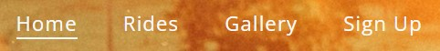
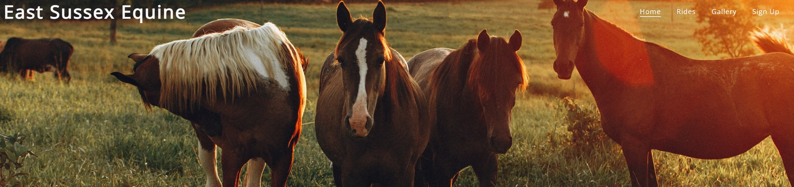
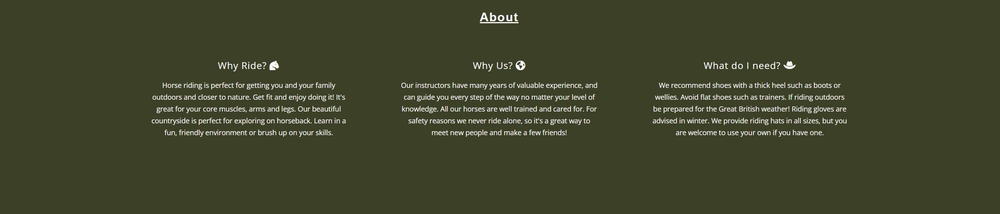
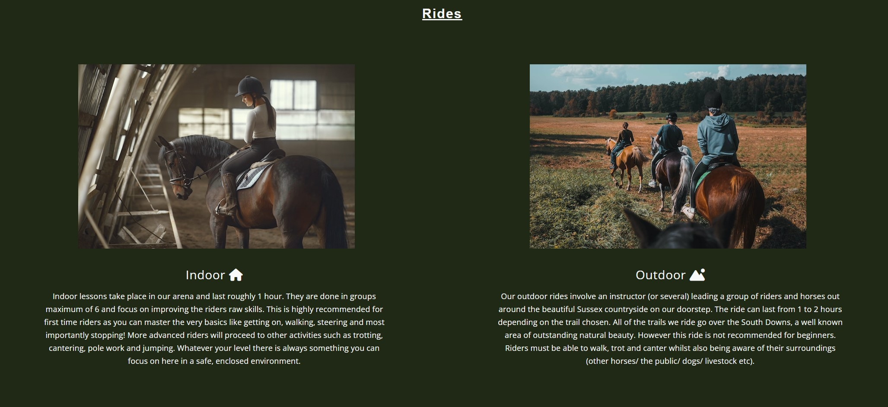
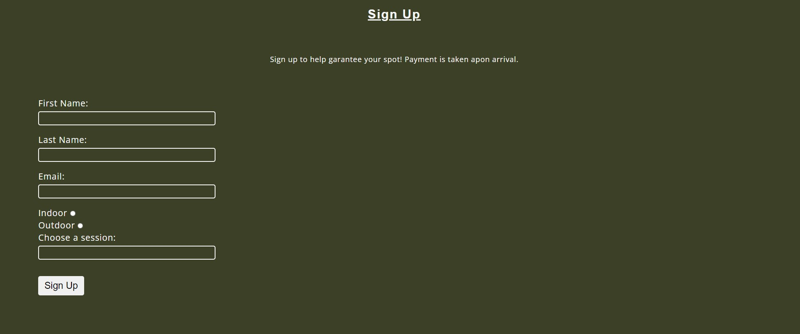
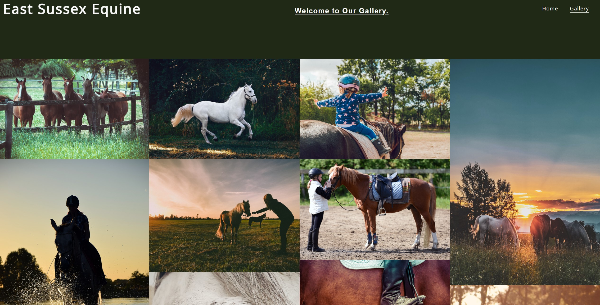
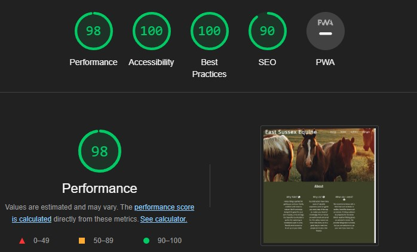
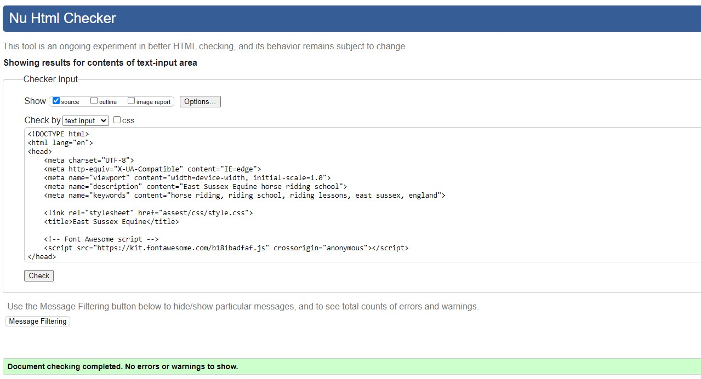
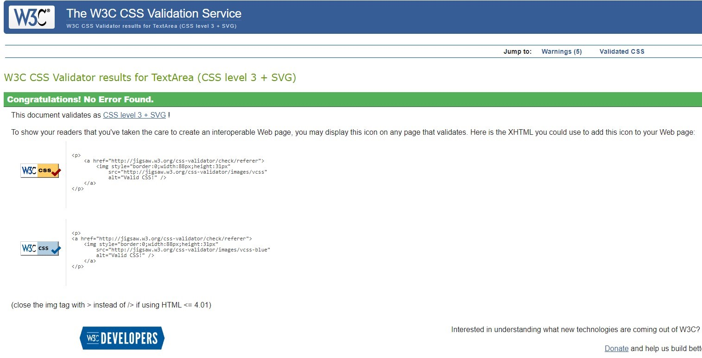

# East Sussex Equine

Welcome to my first ever website! For my first ever site I wanted to choose a topic that lies close to my heart: horse riding. East Sussex Equine is a website that provides users the opportunity to learn more about the riding school and the services it provides. The riding school would be based in East Sussex in England where I grew up, which has beautiful countryside perfect for exploring on horseback. The goal is to create a friendly yet professional looking website to encourage people of any skill level to have a go. In order to achieve this the site must offer plenty of information about the types of rides offered, along with a way to sign up online to make it easy  for potential customers to join. 

---

## Existing Features:

### The Header

- The header shows the logo and the navigation bar. Both can be clicked on to take the user to different parts of the site. I made these white to stand out better against the image background. I found that darker text blended in too well with the dark green and brown shades of the image. 

- The navigation options underline when you hover over them, and stay underlined to show what page you are on.

- At first I was going to make the background just one solid colour, but then I found the hero image which I thought was beautiful and worked really well as a background instead. I knew I wanted the colour theme of my site to be green with white text, to match the colours of the countryside and give the site a natural feel. I actually ended up using a site called **imagecolorpicker.com** to pick specific shades of green from the image, which I then used throughout the site. This really helped the site come together as it gave it a feel of consistency.

### About Section

- The goal of this section is to answer three main questions users might have when visiting the site for the first time: Why should I try horse riding? Why should I ride here specifically? What equipment to I need to ride? It was important not to have too much information here, as I don't want to overwhelm the user. Instead I stuck to three questions with three very short paragraphs containing the most helpful and condensed information to make it easy to read. I added icons to the questions from **fontawesome.com** to help make it more clear what each paragraph was going to be about and draw the users attention.

### Rides Section

- I knew when beginning to plan my website by drawing out a rough layout that I wanted to enclude two images here. One would go with information about riding indoors and one for riding outdoors. I sourced all of my images for this project from **pexels.com** which has thousands of free images to use.

- I used the same font, font color and included icons again to keep consistancy. The background colour is different to show clearly that it is a different section and to break up the page a little. As mentioned earlier this colour is also taken from the hero image, and contrasts nicely with the white text. It's also not too distracting from the images used here.

### Sign Up Section

- This section reverts back to the colour used in the About section, again to keep the consistent look. Here I made a booking form which is fully interactive and functional. Each input box is required before the form can be submitted, the radio buttons work and the submit button inverts its colours when hovered over to make it clear.

- It took me a while to come to a conclusion on the layout of the form. It must be simple and easy to use to encourage people to sign up. This was a challenge as I had a lot of different options to fit into it. At first I tried making two sets of radio buttons, one for indoor/outdoor and the other for a specifc day and time. This ended up looking cluttered and messy as I had so many inputs, so I decided to make a dropdown menu instead which looked much cleaner. 

### The Gallery

- The gallery has a range of photos and shows more or less photos per row depending on the screen size, making them easier to see on smaller devises. This page has a dark green background colour in the header instead of the hero image on the home page. This better draws focus to the gallery photos whilst keeping with the colour scheme. The footer is also present on this page to keep the contact details and social media links easily accessible. 

### The Footer

- The footer contains the company address and links to its social media pages to make it easy for customers to find the location and any additional information. Each of the social mmedia icons were again taken from Font Awesome and can be clicked. They also underline when hovered in keeping with the navigation bar.

## Future Features:

- Something I feel would be a great addition to a website for a business like this would be a map showing the location. The help of Google Maps could make it much easier for people to find the right address and check out the area.

- A schedule page with more times and dates would also be useful, as realistically these tend to change with the seasons. Having rides after school/work times on weekdays means more people are likely to attend. However it's not safe to ride outside at 18:00 in winter as it's already dark. A schedule page explaining this with a regularly updated schedule depending on the time of year would help people understand when the best time is to ride and why. This would also mean that the form inputs would have to change slightly as well and would require more thought.

- A section about prices is also a feature that could be added. This is something any customer would most likely want to know before they book. Making the Sign Up section into a separate page entirely could be a good idea for this. Then all of these future features could go together nicely on that page. For example the page could have a schedule, prices list, booking form and map in that order. It would be logical and clear to have all booking related information on one page.

---

## Testing: 

- I have tested my site on different screen sizes using Devtools to check that it works.
- I have filled out the form multiple times to make sure it works and all the fields are required.
- I have navigated to different sections and pages using the navigation bar to test that it works.
- I have tested my site using the devtools Lighthouse feature. The score is very good with a minimum of 90% in each field.

Lighthouse report:

---

### Validator Testing

- I used the W3C HTML Validator to test my html. The results showed several errors which I then fixed, resulting in 0 errors.

HTML validation after errors fixed:

- I used the W3C CSS Validator to test my CSS. There were a couple of minor errors which were easy to fix, resulting in 0 errors.

CSS validation after errors fixed:

---

### Bugs

- When first creating my form I discovered a bug where my input boxes were not visible to the user and couldn't be typed in.
I fixed the bug by copying and pasting my form code into a comment, then rewriting the form code using the comment as a reference. In doing this I realised in comparison that the original form code was not properly intended, resulting in the visual bug.

Before fix:

After fix:

---

## Deployment:

I deployed my site through Github pages.
- First I went to Github and clicked repositories on the left
- There I found the project I wanted to deploy, clicked on settings and scrolled down to to source 
- Here I changed the source from 'none' to 'main' for the git branch 
- Finally I clicked save and after a short while it produced a link to my deployed site

*insert link here*

---

## Credits:

### Websites to credit:

- [imagecolorpicker.com](https://imagecolorpicker.com/en) -For choosing background colours from the hero image

- [fontawesome.com](https://fontawesome.com/) -Source of all icons used

- [pexels.com](https://www.pexels.com/) -Source of all images used

- [How to add an image to README.md](https://www.seancdavis.com/posts/three-ways-to-add-image-to-github-readme/) -This website by Sean Davis had an extremely useful tutorial showing different ways to add an image to a read me file. It was very helpful as I couldn't figure out why my images weren't displaying.