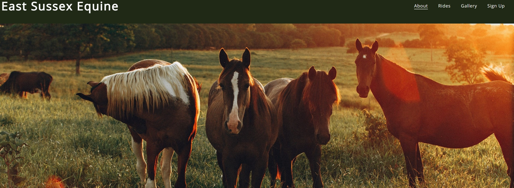
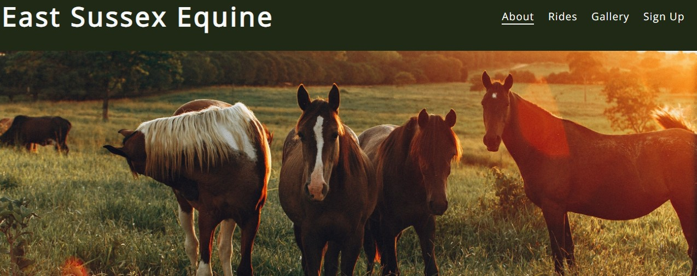
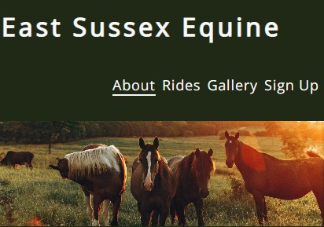
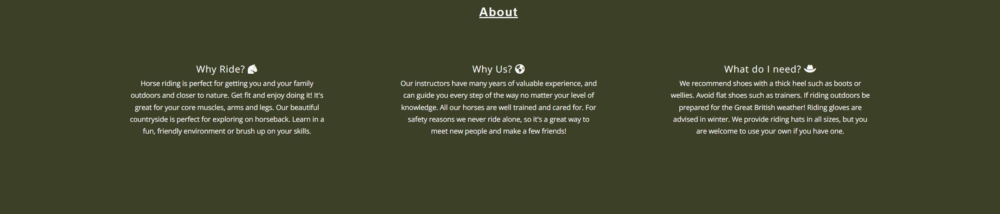
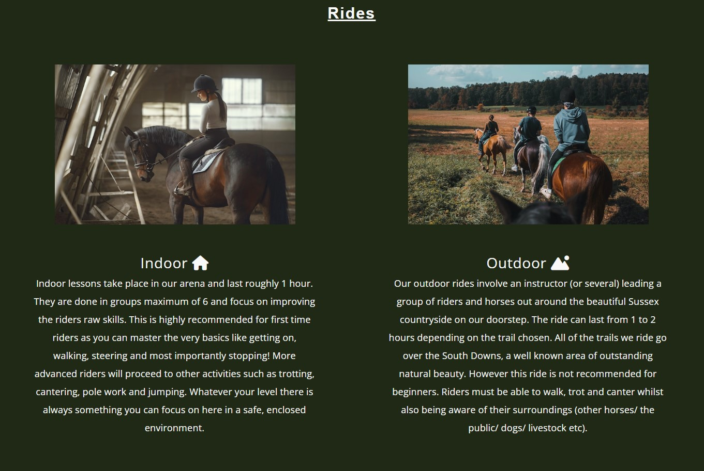

# East Sussex Equine

Welcome to my first ever website! For my first ever site I wanted to choose a topic that lies close to my heart: horse riding. East Sussex Equine is a website that provides users the opportunity to learn more about the riding school and the services it provides. The riding school would be based in East Sussex in England where I grew up, which has beautiful countryside perfect for exploring on horseback. The goal is to create a friendly yet professional looking website to encourage people of any skill level to have a go. In order to achieve this the site must offer plenty of information about the types of rides offered, along with a way to sign up online to make it easy  for potential customers to join. 

### Link to deployed site: https://madeleinewalder.github.io/East-Sussex-Equine/ 

[Photo taken using amiresponsive.com](https://ui.dev/amiresponsive)

---

## User Expectations

### Expectations that this site meets:
- As a user I would like to learn more information about horse riding
- As a user I would like to see photographs of the horses and the environment in which they are ridden
- As a user I would like to be able to sign up for a ride

---

## Existing Features:

### Design Features

- **Color Scheme:** I decided to use a color scheme of green and white to match the color of country side and nature around the location where the riding school would be based. Green fields are a common location for horses and white stands out well against it making for a calming and natural look. I considered using blue to represent the blue sky but it doesn't contrast well enough with green.

- **Font:** I used the fonts 'Open Sans' and 'Noto Sans Japanese' as they compliment each other well with their different weights. As horse riding is an activity for children as well, I kept the fonts fairly simple and bold. I used a heaveir weight for the logo so it would stand out. I kept the paragraphs in the same lighter weight and style, and the h2 elements in the same font with a slightly heavier weight so they would all be easy to distinguish.

### The Header

- **Logo:** The logo is white which follows the color scheme for all text on this site. It also has a heavier font-weight to help it stand out as a logo should. It can be clicked on to navigate the user back to the main page, from the Gallery page for example.

- **Navigation bar:** Can be clicked on to take the user to different parts of the site. The navigation options underline when you hover over them, and stay underlined to show what page you are on. 

- **Hero Image:** I decided to use this image as the hero image as I liked the colors and it was very eye-catching yet not too distracting from the other content. I knew I wanted the colour scheme of my site to be green with white text, so I actually ended up using a site called [imagecolorpicker.com](https://imagecolorpicker.com/en) to pick specific shades of green from the image, which I then used throughout the site, including the dark green background for the logo and navigation bar. This really helped the site come together as it gave it a feel of consistency and made every section fit together.

### About Section

- The goal of this section is to answer three main questions users might have when visiting the site for the first time: Why should I try horse riding? Why should I ride here specifically? What equipment do I need to ride? It was important not to have too much information here, as I don't want to overwhelm the user. Instead I stuck to three questions with three very short paragraphs containing the most helpful and condensed information to make it easy to read and informative. 
- I added icons to the questions from [fontawesome.com](https://fontawesome.com/) to help make it more clear what each paragraph was going to be about and draw the users attention.

### Rides Section

- I knew when beginning to draw out a rough plan of my website that I wanted to enclude two images here. One would go with information about riding indoors and one for riding outdoors. I sourced all of my images for this project from [pexels.com](https://www.pexels.com/) which has thousands of free images to use.

- I used the same font and color as the secton about as well as included icons again to keep consistancy. The background colour is different to show clearly that it is a different section and to break up the page a little. As mentioned earlier this colour is also taken from the hero image, and contrasts nicely with the white text. It's also not too distracting from the images used here.

### Sign Up Section

- This section reverts back to the colour used in the About section, again to keep the consistent look. Here I made a booking form which is fully interactive and functional. Each input box is required before the form can be submitted, the radio buttons work and the submit button inverts its colours when hovered over to make it clear.

- It took me a while to come to a conclusion on the layout of the form. It must be simple and easy to use to encourage people to sign up. This was a challenge as I had a lot of different options to fit into it. At first I tried making two sets of radio buttons, one for indoor/outdoor and the other for a specifc day and time. This ended up looking cluttered and messy as I had so many inputs, so I decided to make a dropdown menu instead which looked much cleaner. 

- When the form is completed and the Sign Up button pressed the user will be taken to a new page, and a large conformation message shown. This is to alert the user that the booking was successful in a clear and polite manner. This page is very basic, with matching background and text color to rest of the site as well as the logo, navigation bar and footer all present.

### The Gallery

- The gallery has a range of photos and shows more or less photos per row depending on the screen size, making them easier to view on smaller devises. This page continues the dark green background color to match the header and footer. This better draws focus to the gallery photos whilst keeping with the colour scheme. The footer is present on this page to keep the contact details and social media links easily accessible. 

### The Footer

- The footer contains the company address and links to its social media pages to make it easy for customers to find the location and any additional information. Each of the social mmedia icons were again taken from Font Awesome and can be clicked. They also invert colors from white to black when hovered in keeping with the Sign Up button, to show that they also take the user to a new page when clicked.

## Future Features:

- Something I feel would be a great addition to a website for a business like this would be a map showing the location. The help of Google Maps could make it much easier for people to find the right address and check out the area.

- A schedule page with more times and dates would also be useful, as realistically these tend to change with the seasons. Having rides after school/work times on weekdays means more people are likely to attend. However it's not safe to ride outside at 18:00 in winter as it's already dark. A schedule page explaining this with a regularly updated schedule depending on the time of year would help people understand when the best time is to ride and why. This would also mean that the form inputs would have to change slightly as well and would require more thought.

- A section about prices is also a feature that could be added. This is something any customer would most likely want to know before they book. Making the Sign Up section into a separate page entirely could be a good idea for this. Then all of these future features could go together nicely on that page. For example the page could have a schedule, prices list, booking form and map in that order. It would be logical and clear to have all booking related information on one page.

---

## Technologies:

- This site was created using two programming languages: HTML and CSS.
- Github and Gitpod are the platforms where I created this website. Github (and Gihub pages) for creating and storing my repositories and Gitpod for writing the code. 
- Unicorn Revealer is an extension for Chrome which I used to help me see the different elements of my site clearly.
- [imagecolorpicker.com](https://imagecolorpicker.com/en) is the website I mentioned earilier which I used for choosing the background colours from my hero image.
- [fontawesome.com](https://fontawesome.com/) is the website where I sourced all my icons.
- [pexels.com](https://www.pexels.com/) is the website I used to source all the images.
- I decided to use the website [amiresponsive.com](https://ui.dev/amiresponsive) to show my finished site on different devices at the end of the Testing section below.

---

## Testing: 

### Supported Screens and Browsers:

- The site was viewed and tested on Google Chrome
- Differnt screen sizes were tested using a simulator that is part of Chrome's dev tools
- As a result all screenshots of different screen sizes are also taken from this simulator
- Supported screen sizes are: Moto G4, iPhone 4, 6, 7, 8, X, XR and 12 Pro, Pixel 5, Samsung Galaxy S8+, S20 Ultra and A51/71, iPad, iPad Air, Mini and Pro, Surface Pro 7, Surface Duo, Nest Hub and Nest Hub Max.

### Test Cases
 
- When the user first opens the website the main page is shown, with the logo, navigation menu and hero-image.

Example of desktop screensize:

Example of tablet screensize:

Example of phone screensize:

- The user should notice that the 'Home' option on the navigation bar is underlined, showing that they are currently viewing this section.

- Just under the header is the About section which provides more information on why customers should ride, and why they should choose us as well as what they need to bring.

Example of desktop screensize:

Example of tablet screensize:

Example of phone screensize:

- The user can either scroll down, or click the 'Rides' option on the navigation bar to see more information on the services offered.
- Apon hovering the mouse over the navigation bar options the user will see that they underline to make it clear which one they are selecting and show that they are clickable.

Example of desktop screensize:

Example of tablet screensize:

Example of phone screensize:

- Clicking the 'Sign-Up' option on the navigation bar, or scrolling down the main page will lead the user to the Sign-up section. Here the booking form can be filled in if the user wants to.
- Each field is required for the form to be completed and sent.

Example of desktop screensize:

Example of tablet screensize:

Example of phone screensize:

- To complete the form the user can click the Sign Up button. When hovered this button inverts its colors to black with white text. This shows that is it clickable and makes it stand out.
- When the form is complete and the Sign Up button clicked, the user will be taken to the conformation page.
- They will see the header with the logo and the navigation bar. The 'Sign-up' option will be underlined to show that this is the section being viewed.
- From this page the user can return to the main page by clicking on the logo. Alternatively they can use navigation bar as on the main page to navigate around.

Example of desktop screensize:

Example of tablet screensize:

Example of phone screensize:

- If the user wishes to see photographs they can visit the Gallery page by clicking 'Gallery' on the navigation bar.
- When taken to this page the user will be able to see the logo and a navigaion bar as usual. 'Gallery' will be underlined on the navigation bar to show that it is the current page being viewed.
- To view all the photos the user may scroll down. Again users have the ability to click on the logo to return to the main page if they wish or navigate using the navigation bar which is also present here.

Example of tablet screensize:

Example of phone screensize:

- At the bottom of **every page** is the footer where the user can see the address information and links to the social media pages for the site.
- When hovered the social media icons which act as clickable links turn from white to black, similar to the Sign Up button. When clicked the pages will open in a new tab.

Example of desktop screensize:

Example of tablet screensize:

Example of phone screensize:

---

### Validator Testing

- I used the [W3C HTML Validator](https://validator.w3.org/#validate_by_input) to test my html. The results showed several errors which I then fixed, resulting in 0 errors.

HTML validation after errors fixed:

- I used the [W3C CSS Validator](https://jigsaw.w3.org/css-validator/#validate_by_input) to test my CSS. There were a couple of minor errors which were easy to fix, resulting in 0 errors.

CSS validation after errors fixed:

- I have tested my site using the devtools Lighthouse feature. The score is very good with a minimum of 90% in each field.

---

### Bugs

- When first creating my form I discovered a bug where my input boxes were not visible to the user and couldn't be typed in.
I fixed the bug by copying and pasting my form code into a comment, then rewriting the form code using the comment as a reference. In doing this I realised in comparison that the original form code was not properly intended, resulting in the visual bug.

Before fix:

After fix:

---

## Deployment:

### Gitpod

- Typing 'python3 -m http.server' into the Gitpod terminal allows you to view the site in a browser as if it were live
- Every time a secton of code is added the browser can be refreshed to see the change, sometimes you need to press ctrl, shift and R for changes to be updated
- To save and commit progress, type 'git add .' into the terminal followed by 'git commit -m' and then your message describing what you did in double quotes
- Typing 'git push' will then push your code, and this should be done at the end of every coding session or whenever you want an already deployed site to be updated

### Github Pages

- To deploy my site I first went to Github and found my project repository on the left hand side and clicked it
- I then clicked on 'Settings' and then the 'Pages' option on the left   
- Here I changed the branch from 'none' to 'main'
- Finally I clicked save and after a short while it produced a link to my deployed site

**Link to deployed site:**
https://madeleinewalder.github.io/East-Sussex-Equine/ 

---

## Credits:

- [seancdavis.com](https://www.seancdavis.com/posts/three-ways-to-add-image-to-github-readme/) -This website by Sean Davis had an extremely useful tutorial showing different ways to add an image to a read me file on Github. It was very helpful as I couldn't figure out why my images weren't displaying. He explained that you need an '!' in front of the square brackets to add an image instead of just a link. This was why my images weren't visible.
- I also used [css-tricks.com](https://css-tricks.com/snippets/css/a-guide-to-flexbox/) and [w3schools.com](https://www.w3schools.com/css/css3_flexbox.asp). Both had very good tutorials on how to code with flexbox. Whilst I already knew how to write the HTML side these tutorials helped me understand the different flex rules you can apply in CSS, such as flex-wrap: wrap; which I did use in my own work.